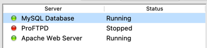
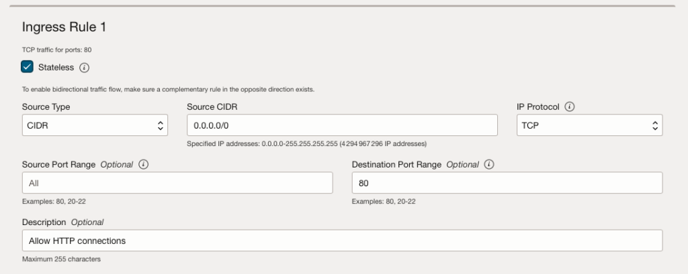

# Meditech

## Introduction

Meditech est un projet développé par Maxime et Valentin. Il s'agit d'un site web en PHP qui permet de gérer les stocks de médicaments et d'afficher un tableau de bord avec des informations sur ces stocks. L'objectif principal de ce projet est de réaliser une application web fonctionnelle, déployée sur un serveur Apache et utilisant une base de données.

## Prérequis

Pour développer et exécuter le projet Meditech, il faut disposer de l'environnement de développement suivant :

- En local :
  - **XAMPP :**
    1. Télécharger XAMPP depuis le site officiel : [https://www.apachefriends.org](https://www.apachefriends.org)
    2. Double-cliquer sur le fichier d'installation téléchargé
    3. Une fenêtre de confirmation d'utilisateur apparaît, cliquer sur "Oui"
    4. Dans la fenêtre de bienvenue de l'assistant d'installation, cliquer sur "Next"
    5. Sélectionner les composants à installer (Apache, MySQL, PHP) et cliquer sur "Next"
    6. Choisir le dossier d'installation (par défaut : C:\\xampp) et cliquer sur "Next"
    7. Lancer XAMPP Control Panel
    8. Démarrer les services Apache et MySQL en cliquant sur les boutons "Start" correspondants
        
  
  - **MariaDB :**
    1. MariaDB est inclus dans XAMPP, il n'y a pas besoin de l'installer séparément
    2. Pour accéder à MariaDB, ouvrir un navigateur web et accéder à `http://localhost/phpmyadmin`

  - **Git :**
    1. Télécharger Git depuis le site officiel : [https://git-scm.com/downloads](https://git-scm.com/downloads)
    2. Cliquer sur l'OS de votre ordinateur
    3. Suivez les instructions données

  - **PhpStorm :**
    1. Télécharger PhpStorm depuis le site officiel : [https://www.jetbrains.com/phpstorm/download/](https://www.jetbrains.com/phpstorm/download/)
    2. Double-cliquer sur le fichier d'installation téléchargé
    3. Dans la fenêtre de bienvenue de l'assistant d'installation, cliquer sur "Next"
    4. Choisir le dossier d'installation (par défaut : C:\\Program Files\\JetBrains\\PhpStorm) et cliquer sur "Next"
    5. Sélectionner les options d'installation (associations de fichiers, raccourcis) et cliquer sur "Next"
    6. Cliquer sur "Install" pour démarrer l'installation
    7. Cocher l'option "Run PhpStorm" et cliquer sur "Finish" pour terminer l'installation et lancer PhpStorm

  - **Terminus :**
    1. Télécharger Terminus depuis le site officiel
    2. Double-cliquer sur le fichier d'installation téléchargé
    3. Dans la fenêtre de bienvenue de l'assistant d'installation, cliquer sur "Next"
    4. Lire le contrat de licence, accepter les termes et cliquer sur "Next"
    5. Choisir le dossier d'installation (par défaut : C:\\Program Files\\Terminus) et cliquer sur "Next"
    6. Sélectionner le dossier du menu Démarrer et cliquer sur "Next"
    7. Sélectionner les tâches supplémentaires (raccourci bureau, ajout PATH) et cliquer sur "Next"
    8. Cliquer sur "Install" pour démarrer l'installation
    9. Cliquer sur "Finish" pour terminer l'installation


- Sur un serveur Oracle :
  - Ouvrir un compte sur Oracle Cloud : [https://www.oracle.com/cloud/free/](https://www.oracle.com/cloud/free/)
  - Se connecter à l'interface web d'Oracle Cloud
  - Accéder au menu "Compute" et sélectionner "Instances"
  - Cliquer sur "Create Instance"
  - Renseigner les informations de l'instance (nom, système d'exploitation, type de machine)
  - Dans la section "Add SSH Keys", sélectionner "Generate a key pair for me" et télécharger la clé privée
  - Cliquer sur "Create" pour créer l'instance
  - Une fois l'instance créée, noter l'adresse IP publique
  - Dans la section "Security Lists" du sous-menu "Networking", cliquer sur la security list par défaut
  - Cliquer sur "Add Ingress Rule"
  - Renseigner les informations suivantes :
    - Source CIDR: 0.0.0.0/0
    - Destination Port Range: 80
  - Cliquer sur "Add Ingress Rule" pour ajouter la règle autorisant le trafic entrant sur le port 80
    
  - Ouvrir Terminus et créer une nouvelle connexion SSH en cliquant sur "New Host" puis "SSH"
  - Renseigner l'adresse IP publique de l'instance dans le champ "Host"
  - Renseigner le nom d'utilisateur (par défaut : ubuntu)
  - Renseignez la clé privée téléchargée précédemment
  - Cliquer sur "Connect" pour se connecter à l'instance
  - Une fois connecté, exécuter les commandes suivantes pour installer les prérequis :
    ```
    sudo apt update && sudo apt upgrade
    sudo apt install php mysql-server apache2 git
    ```

## Installation

Voici les étapes détaillées pour installer et configurer le projet Meditech :

1. Ouvrir Terminus et se placer dans le dossier `htdocs` de XAMPP :
   cd C:\xampp\htdocs
2. Cloner le dépôt Git du projet dans le dossier `htdocs` de XAMPP :
   git clone https://github.com/Valentinnnnnnnnnn/meditech
3. Ouvrir phpMyAdmin dans un navigateur web en accédant à `http://localhost/phpmyadmin`
5. Importer le fichier SQL fourni (base.sql)
6. Ouvrir le projet dans PhpStorm
8. Démarrer les services Apache et MySQL dans XAMPP Control Panel (vu précédemment)
9. Accéder à l'application dans un navigateur web en utilisant l'URL `http://localhost/[nom_du_dossier_projet]`

## Fonctionnalités

Les principales fonctionnalités de l'application Meditech sont les suivantes :

- Création de compte utilisateur
- Connexion et déconnexion
- Affichage des statistiques sur le tableau de bord :
- Nombre de produits différents
- Nombre de produits en stock
- Nombre de fabricants
- Nombre de types de médicaments
- Affichage des logs sur le tableau de bord
- Création de compte
- Connexion et déconnexion
- Création, modification et suppression de produits
- Gestion des produits
- Affichage de la liste des produits avec leurs détails
- Modification des informations d'un produit
- Création de nouveaux produits
- Suppression de produits

## Architecture

Voici l'organisation détaillée des fichiers et des dossiers du projet Meditech :

- `login.php` : Page de connexion permettant aux utilisateurs de s'authentifier
- `loginSubmit.php` : Fichier de traitement de la soumission du formulaire de connexion
- `createProduct.php` : Formulaire de création d'un nouveau produit
- `createSubmit.php` : Fichier de traitement de la soumission du formulaire de création de produit
- `deleteProduct.php` : Fichier de traitement de la suppression d'un produit
- `editSubmit.php` : Fichier de traitement de la soumission du formulaire de modification de produit
- `productDetail.php` : Page affichant les détails d'un produit spécifique
- `productEdit.php` : Formulaire de modification des informations d'un produit
- `products.php` : Page affichant la liste de tous les produits
- `signup.php` : Page d'inscription permettant aux utilisateurs de créer un compte
- `signupSubmit.php` : Fichier de traitement de la soumission du formulaire d'inscription
- `index.php` : Page d'accueil affichant le tableau de bord avec les statistiques et les logs
- `logout.php` : Fichier de traitement de la déconnexion de l'utilisateur
- `script.php` : Fichier contenant la classe de connexion à la base de données et les fonctions associées

## Base de données

Le schéma de la base de données du projet Meditech comprend les tables suivantes :

- `utilisateurs` : Table contenant les informations des utilisateurs
  - `identifiant` : Champ de type VARCHAR(50) qui stocke l'identifiant unique de chaque utilisateur. C'est la clé primaire de la table.
  - `mot_de_passe` : Champ de type VARCHAR(255) qui stocke le mot de passe hashé de l'utilisateur.


- `events` : Table contenant les logs des actions effectuées dans l'application
  - `id` : Champ de type INT qui sert d'identifiant unique pour chaque événement. C'est la clé primaire de la table et il s'incrémente automatiquement.
  - `date` : Champ de type DATETIME qui stocke la date et l'heure de l'événement. Il est toujours renseigné et ne peut pas être nul.
  - `auteur` : Champ de type VARCHAR(255) qui stocke l'identifiant de l'utilisateur à l'origine de l'événement. Il ne peut pas être nul.
  - `action` : Champ de type ENUM qui stocke le type d'action effectuée. Les valeurs possibles sont 'create', 'delete', 'edit', 'connected', 'disconnected', et 'accountCreate'. Cela permet de catégoriser les événements.
  - `target` : Champ de type VARCHAR(255) qui stocke la cible de l'action (par exemple, l'identifiant du produit modifié). Il peut être nul si l'action ne concerne pas une cible spécifique.


- `medicaments` : Table contenant les informations des médicaments
  - `id` : Champ de type INT qui sert d'identifiant unique pour chaque médicament. C'est la clé primaire de la table et il s'incrémente automatiquement.
  - `reference` : Champ de type VARCHAR(255) qui stocke la référence du médicament. Il peut être nul.
  - `img` : Champ de type VARCHAR(255) qui stocke le chemin relatif du fichier image associé au médicament. Il peut être nul.
  - `creation` : Champ de type DATE qui stocke la date de création du médicament. Il peut être nul.
  - `prix` : Champ de type FLOAT qui stocke le prix du médicament. Il peut être nul.
  - `derniere_modification` : Champ de type DATE qui stocke la date de dernière modification des informations du médicament. Il peut être nul.
  - `quantite` : Champ de type INT qui stocke la quantité en stock du médicament. Il peut être nul.
  - `description` : Champ de type VARCHAR(1024) qui stocke la description du médicament. La taille de 1024 caractères permet de stocker des descriptions détaillées. Il peut être nul.
  - `fabricant` : Champ de type VARCHAR(255) qui stocke le nom du fabricant du médicament. Il peut être nul.
  - `type` : Champ de type VARCHAR(255) qui stocke le type du médicament. Il peut être nul.

## Sécurité

Les mesures de sécurité mises en place dans le projet Meditech sont les suivantes :

- **Hachage des mots de passe :**
 Lors de l'inscription d'un nouvel utilisateur, le mot de passe est haché avant d'être stocké dans la base de données.
Lors de la connexion, le mot de passe saisi par l'utilisateur est haché et comparé au hash stocké dans la base de données.


- **Prévention des injections SQL avec PDO et les requêtes préparées :**
  - Toutes les requêtes SQL sont exécutées à l'aide de l'extension PDO qui fournit une interface pour accéder à la base de données.
  - Les requêtes préparées sont utilisées pour éviter les injections SQL. Les données fournies par l'utilisateur sont associées à des paramètres dans la requête préparée, puis exécutées séparément. Cela empêche l'interprétation des données utilisateur comme du code SQL malveillant.


- **Utilisation de variables d'environnement pour les informations sensibles :**
  - Les informations sensibles telles que les identifiants de connexion à la base de données sont stockées dans des variables d'environnement.
  - Les variables d'environnement sont définies en dehors du code source et chargées à l'exécution. Cela évite de stocker ces informations directement dans le code et réduit les risques de fuite d'informations sensibles.


- **Configuration d'un virtual host (vhost) pour l'application :** 
Un virtual host spécifique à l'application est configuré sur le serveur Apache. Cela permet d'isoler l'application des autres applications hébergées sur le même serveur.


- **L'authentification et l'autorisation des utilisateurs sont gérées à l'aide des sessions PHP.** Lorsqu'un utilisateur se connecte avec succès, une session est créée pour stocker les informations de l'utilisateur (identifiant et mot de passe). Ces informations sont utilisées pour vérifier l'autorisation de l'utilisateur lors de l'accès aux différentes pages et fonctionnalités de l'application. La session est détruite lors de la déconnexion de l'utilisateur.

## Conclusion

Le projet Meditech offre une base solide pour la gestion des stocks de médicaments. Il permet aux utilisateurs de créer des comptes, de se connecter, de visualiser les statistiques et les logs, ainsi que de gérer les produits (ajout, modification, suppression).

Cependant, il existe des perspectives d'amélioration et d'évolution pour ce projet, telles que :
- L'ajout de rôles pour les comptes utilisateurs afin de définir différents niveaux d'accès et de permissions (administrateur, utilisateur standard, etc.).
- La gestion des utilisateurs par les comptes administrateurs, permettant aux administrateurs de créer, modifier et supprimer des comptes utilisateurs.
- L'amélioration de la sécurité pour contrer les attaques par force brute, par exemple en limitant le nombre de tentatives de connexion infructueuses ou en implémentant un système de verrouillage temporaire des comptes.
- L'optimisation de l'architecture des dossiers pour une meilleure organisation et maintenabilité du code source.

### Informations supplémentaires
- Repo Github : `https://github.com/Valentinnnnnnnnnn/meditech`
- IP du serveur : `89.168.44.77`
